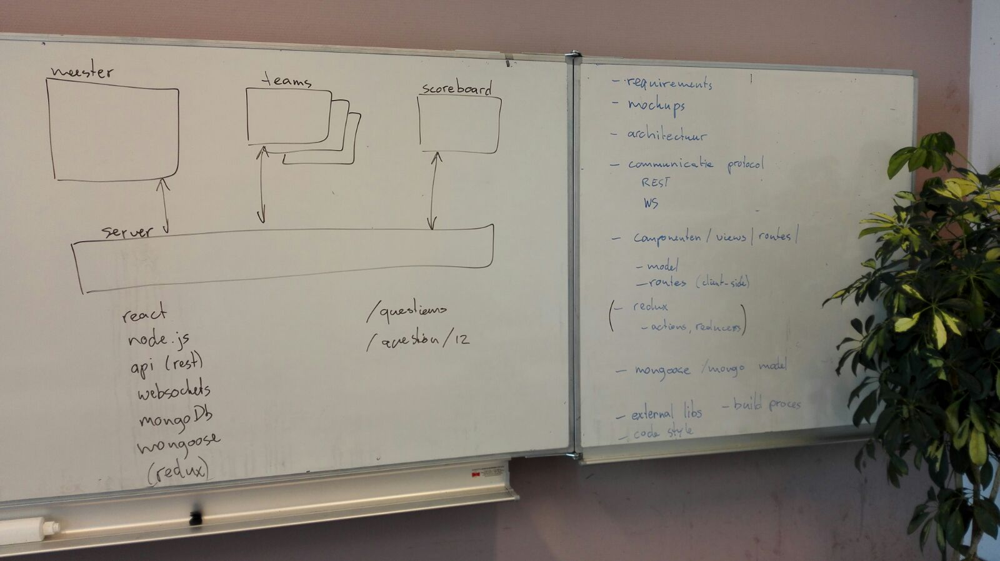

# kwizzert

Een real-time webapplicatie om in teamverband quizzen te spelen.

## Requirements
### Algemeen
* De server moet meerdere kwizzen in verschillende pubs kunnen ondersteunen aan de hand van een verificatie code.
* Er moeten 3 SPA's geprogrammeerd worden:
   * Team-app
   * KwizMeestert-app
   * Scorebord-app
* Deze applicaites moeten door 1 server worden aangestuurd.
* Near realtime communicatie door middel van websockets is verplicht.
* Aan het einde van de ronde moet de server automatisch het totaal aantal punten voor elk team uitrekenen.
* De puntentelling gaat per ronde alsvolgt: Het team wat de meeste vragen goed heeft krijgt 4 punten, daarna 2 en daarna 1 en de rest 0.1.

### Team-app
* Deze app moet kunnen draaien op een smartphone.
* Er moet een scherm voor aanmelden bij de kwiz getoond worden waar naam en wachtoord ingevoerd kunnen worden. 
* De velden naam en wachtwoord mogen niet leeg worden opgestuurd.
* De app moeten tonen of het team geaccepteerd is door de server of de kwismeestert.
* De app moet een vraag tonen.
* Er moet een antwoord kunnen worden ingevuld als tekst.
* In de applicatie kan een antwoord worden gewijzigd totdat de vraag gesloten wordt door de kwizmeestert.
* Lege antwoorden kunnen niet worden ingestuurd.

### KwizMeestert-app
* Moet draaien op een tablet.
* Kwizavond starten door middel van het invoeren van een wachtwoord en het klikken op start.
* Aanmeldingen van teams accepteren of weigeren.
* De kwiz starten.
* 3 categorieën selecteren en op de startronde knop klikken.
* Na elke ronde klikken op nieuwe ronde of stoppen.
* Een vraag kiezen uit de lijst met getoonde vragen uit de drie gekozen categorieën.
* Een vraag starten door op de knop te klikken.
* Een vraag stoppen door op de knop te klikken.
* Antwoorden goed- of afkeuren.

### Scorebord-app
* De app moet draaien op een groot scherm.
* Het door de kwizmeestert aangemaakte wachtwoord tonen.
* Geaccepteerde teams weergeven.
* Huidige vraag en de categorie van deze vraag tonen.
* Tonen welke teams een antwoord hebben ingestuurd.
* De namen van de teams met hun rondepunten en aantal goede vragen tonen.
* De voortgang van de kwiz tonen, namelijk de hoeveelste ronde en hoeveelste vraag.
* De antwoorden van de teams worden getoond als de vraag door de kwizmeestert gesloten is.
* Goedkeuring of afkeuring van de vraag door kwizmeestert per team tonen.
* Na afloop tonen welk team er gewonnen heeft en hoeveel punten alle teams behaald hebben, de nummer 1 moet extra nadruk hebben.

### Server
* Deze moet controleren of de ingestuurde namen van de teams al bestaan.
* Elke vraag mag maar 1 keer worden gesteld.

### Lay-out
* Bij het tonen van de vraag mag deze niet buiten het beeld vallen, de vraag moet goed te lezen zijn. We houden rekening tot en met de langste vraag die op dit moment in de database staat.
* We houden bij het creeën van de lay-out rekening met het maximale aantal deelnemers van 6 teams.

## Screenshots
_screenshots_

## Architectuur

## Communicatie protocol
* Rest
* ws

## Componenten / Views / Routes
* Componenten per pagina
* ...

## Redux
* Als het nodig is zal dit alleen bij de kwismeestert worden toegepast. Bij de rest is het niet noodzakelijk.

## Mongoose / Mongo model
_Volgt zodra de database bekend is_

## Externe libs
* React
* Node.js
* API (Rest)
* Websockets
* MongDB
* Mongoose
* Redux

## Build proces
_Volgt later_

## Code style
![link]https://github.com/airbnb/javascript

## Extra
* Veiligheid
* ...

---
### Autheurs
Christiaan ten Voorde & Stefan Vonk
