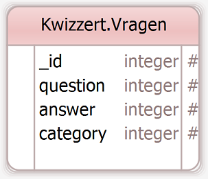

# Kwizzert

Een real-time webapplicatie om in teamverband quizzen te spelen.

## Requirements
### Algemeen
* De server moet meerdere kwizzen in verschillende pubs kunnen ondersteunen aan de hand van een verificatie code.
* Er moeten 3 SPA's geprogrammeerd worden:
   * Team-app
   * KwizMeestert-app
   * Scorebord-app
* Deze applicaites moeten door 1 server worden aangestuurd.
* Near realtime communicatie door middel van websockets is verplicht.
* Aan het einde van de ronde moet de server automatisch het totaal aantal punten voor elk team uitrekenen.
* De puntentelling gaat per ronde alsvolgt: Het team wat de meeste vragen goed heeft krijgt 4 punten, daarna 2 en daarna 1 en de rest 0.1.

### Team-app
* Deze app moet kunnen draaien op een smartphone.
* Er moet een scherm voor aanmelden bij de kwiz getoond worden waar naam en wachtoord ingevoerd kunnen worden. 
* De velden naam en wachtwoord mogen niet leeg worden opgestuurd.
* De app moeten tonen of het team geaccepteerd is door de server of de kwismeestert.
* De app moet een vraag tonen.
* Er moet een antwoord kunnen worden ingevuld als tekst.
* In de applicatie kan een antwoord worden gewijzigd totdat de vraag gesloten wordt door de kwizmeestert.
* Lege antwoorden kunnen niet worden ingestuurd.

### KwizMeestert-app
* Moet draaien op een tablet.
* Kwizavond starten door middel van het invoeren van een wachtwoord en het klikken op start.
* Aanmeldingen van teams accepteren of weigeren.
* De kwiz starten.
* 3 categorieën selecteren en op de startronde knop klikken.
* Na elke ronde klikken op nieuwe ronde of stoppen.
* Een vraag kiezen uit de lijst met getoonde vragen uit de drie gekozen categorieën.
* Een vraag starten door op de knop te klikken.
* Een vraag stoppen door op de knop te klikken.
* Antwoorden goed- of afkeuren.

### Scorebord-app
* De app moet draaien op een groot scherm.
* Het door de kwizmeestert aangemaakte wachtwoord tonen.
* Geaccepteerde teams weergeven.
* Huidige vraag en de categorie van deze vraag tonen.
* Tonen welke teams een antwoord hebben ingestuurd.
* De namen van de teams met hun rondepunten en aantal goede vragen tonen.
* De voortgang van de kwiz tonen, namelijk de hoeveelste ronde en hoeveelste vraag.
* De antwoorden van de teams worden getoond als de vraag door de kwizmeestert gesloten is.
* Goedkeuring of afkeuring van de vraag door kwizmeestert per team tonen.
* Na afloop tonen welk team er gewonnen heeft en hoeveel punten alle teams behaald hebben, de nummer 1 moet extra nadruk hebben.

### Server
* Deze moet controleren of de ingestuurde namen van de teams al bestaan.
* Elke vraag mag maar 1 keer worden gesteld.

### Lay-out
* Bij het tonen van de vraag mag deze niet buiten het beeld vallen, de vraag moet goed te lezen zijn. We houden hierbij rekening tot en met de langste vraag die op dit moment in de database staat.
* We houden bij het creeën van de lay-out rekening met het maximale aantal deelnemers van 6 teams.


## Low fidelity designs
Hieronder volgen de screenshots voor elke SPA:
### De Team-app - Smartphone


### De KwizMeestert-app - Tablet


### De Scorebord-app - Beamer


## Architectuur


## Communicatie protocol
### Team-app
* Rest

* ws 
  * Verificatie geaccepteerd:
    * Type: teamgeaccepteerd
    * String: _melding_
  * Ontvangst vraag:
    * Type: ontvangstvraag
    * String: _vraag_
  * Vraag afbreken:
    * Type: afbrekenvraag
  * Kwiz gestopt:
    * Type: Kwizgestopt

### KwizMeestert-app
* Rest

* ws
  * Verificatie geaccepteerd:
    * Type: kwizavondgestart
    * Boolean: _geaccepteerd_
  * Ontvangst teamnaam:
    * Type: teamaangemeld
    * String: _teamnaam_
  * Ontvangst categorieën:
    * Type: ontvangstcategorieen
    * Array[String]: _categorieën_
  * Ontvangst vragen:
    * Type: ontvangstvragen
    * Array[vragen: {
        ObjectID: _id,
        String: question,
        String: answer,
        String: category
      }]: _vragen_
  * Ontvangst teamantwoorden:
    * Type: ontvangstantwoorden
    * Array[vragen: {
        String: teamnaam,
        String: antwoord,
      }]: _teamnantwoorden_

### Scorebord-app
* Rest

* ws
  * Verificatie code ontvangen:
    * Type: ontvangstcode
    * String: _code_
  * Geaccepteerd team:
    * Type: geaccepteerdteam
    * String: _teamnaam_
  * Ontvangst vraag:
    * Type: scoreboardvraag
    * {
        Number: rondenummer,
        Number: vraagnummer,
        String: question,
        String: category
      }: _vraag_
  * Ontvangst teamnaam:
    * Type: scoreboardteamnaam
    * String: _teamnaam_
  * Ontvangst teamgegevens:
    * Type: scoreboardteamgegevens
    * Array[teams: {
        String: teamnaam,
        String: antwoord,
        Number: rondepunten,
        Number: vragengoed
      }]: _teamgegevens_
  * Gecontroleerd antwoord:
    * Type: scoreboardgecontroleerdantwoord
    * Boolean: _correct_
  * Scorelijst ontvangen
    * Type: scorelijst
    * Array[teams: {
        String: teamnaam,
        Number: rondepunten
      }]: _scorelijst_

### Server
* Rest

* ws
  * Verificatie code:
    * Type: startkwizavond
    * String: _code_
  * Team geaccepteerd:
    * Type: teamgeaccepteerd
    * String: _teamnaam_
    * Boolean: _geaccepteerd_
  * Kwiz starten:
    * Type: startkwiz
  * Ronde starten:
    * Type: startronde
    * Array[String]: _3 categorieën_
  * Kwiz stoppen:
    * Type: stopkwiz
  * Vraag starten
    * Type: startvraag
    * {
        ObjectID: _id,
        String: question,
        String: answer,
        String: category
      }: _vraag_
  * Vraag stoppen:
    * Type: stopvraag
  * Antwoord gecontroleerd:
    * Type: antwoordgecontroleerd
    * String: _teamnaam_
    * Boolean: _goedgekeurd_
  * Volgende:
    * Type: volgende
  * Team aanmelden:
    * Type: aanmeldenteam
    * String: _code_
    * String: _teamnaam_
  * Ontvangst antwoord:
    * Type: ontvangstantwoord
    * String: _antwoord_

## Componenten / Views / Routes
De omschrijvingen zijn als volgt opgebouwd:
### _Naam van de app_
* _(Nummer van scherm) Component_
  * _Omschrijving pagina_

### Team-app
* (1) aanmelden
  * Op dit scherm kan het team zich aanmelding door middel van het invoeren van de code en het opgeven van de teamnaam. Aan de onderzijde van het scherm kunnen meldingen verschijnen zoals de melding dat de teamnaam al gekozen is.
* (2) kwiz
  * Op dit scherm wordt de kwiz gespeelt en ook hier kunnen meldingen verschijnen aan de onderzijde van het scherm.
* (3) kwizgesloten
  * Dit scherm wordt weergegeven als de kwiz wordt gesloten. Er is een knop om terug te gaan naar het aanmeldscherm.

### KwizMeestert-app
* (1) kwizstarten
  * Op dit scherm kan de kwizmeestert een code invoeren en de kwiz starten.
* (2) teamsaccepteren
  * Hier worden alle teams die zich aanmelden getoond en kan de kwizmeestert de teams accepteren. Er is ook een knop om de kwiz te starten.
* (3) rondestarten
  * Er kunnen 3 categorieën gekozen worden en een ronde kan worden gestart. De kwiz kan op dit scherm ook worden gestopt.
* (4) vragenkiezen
  * Op dit scherm worden vragen getoond waaruit er 1 kan worden geselecteerd. De vraag kan in dit scherm worden gestart en vervolgens gestopt.
* (5) antwoordcontroleren
  * De antwoorden per team verschijnen in dit scherm en kunnen goedgekeurd of afgekeurd worden. Onderaan staat een knop om naar de volgende vraag te gaan.

### Scorebord-app
* (1) voorafkwiz
  * Het wachtwoord en de deelnemende teams worden weergegeven.
* (2) actievevraag
  * De voortgang, huidige vraag en categorie en de teamnamen van de teams die antwoord hebben gegeven.
* (3) beoordelingvraag
  * De voortgang en een overzicht van de goed- of foutgekeurde atwoorden en score per team worden weergegeven.
* (4) achterafkwiz
  * De teamnamen plus hun scores worden weergegeven.

## Redux
* Als het nodig is zal dit alleen bij de kwismeestert worden toegepast. Bij de rest is het niet noodzakelijk.

## Mongoose / Mongo model
Hieronder het model voor de database:



Wij hebben ervoor gekozen alleen de vragen in de database op te slaan, alle verdere gegevens worden in het geheugen opgeslagen.
Dit willen we doen door het aanmaken van een object. Hieronder volgt de implementatie daarvan:

```js
let state = {
    kwizzen: [{
        code: "",
        kwizmeestertSocket: null,
        beamerSocket: null,
        gesteldeVragen: [],
        huidigevraag: {
            vraag: "",
            antwoord: ""
        },
        teams : [{
            teamSocket: null,
            teamnaam: "",
            huidigAntwoord: "",
            rondepunten : 0,
            vragenGoed: 0
        }]
    }]
};
```

## Externe libs
* React
* Node.js
* API (Rest)
* Websockets
* MongDB
* Mongoose
* Redux

## Build proces
_Volgt later_

## Code style
https://github.com/airbnb/javascript

## Extra
* Veiligheid
* Bij het afsluiten van de applicatie van de kwizmeestert kan hij na opnieuw openen verder waar hij gebleven was.

---
### Autheurs
Christiaan ten Voorde & Stefan Vonk
